# Architecture Plan - Kinevo Forms & Inbox (v2)

## 1) Objetivo e escopo

Este documento define a arquitetura do módulo **Avaliações e Comunicação (Forms & Inbox)** com foco em:

- Criação de formulários personalizados pelo treinador.
- Criação de formulários com assistência de IA e revisão humana obrigatória.
- Envio de formulários para alunos via Inbox.
- Resposta de formulários no app mobile.
- Visualização de respostas e contra-resposta do treinador.
- Base arquitetural preparada para evolução futura para mensagens de texto/chat.

Atualizações estratégicas desta versão (v2):

1. Segurança de Storage para imagens (bucket privado + Signed URL + políticas de acesso).
2. Estratégia Offline-First para preenchimento de formulários longos.
3. Validação obrigatória no backend na submissão (`trust no one`).
4. Atualização em tempo real da Inbox com Supabase Realtime.
5. Assistente de IA útil para acelerar criação de formulários e elevar qualidade de perguntas.

---

## 2) Princípios de arquitetura

- **Híbrida relacional + JSONB**: colunas para filtros e relacionamento, JSONB para flexibilidade de perguntas/respostas.
- **Snapshot imutável de schema**: cada envio registra o schema no momento do assignment.
- **Inbox como hub**: todo item de comunicação no mobile entra por `student_inbox_items`.
- **Segurança por padrão**: RLS no banco e no Storage, sem exposição pública de mídias sensíveis.
- **Resiliência mobile**: rascunho local com restauração automática/opcional.
- **Reatividade**: UI sincronizada por Realtime sem refresh manual.
- **Human-in-the-loop**: IA apenas sugere, treinador aprova antes de qualquer envio ao aluno.
- **Saída estruturada e validável**: IA deve retornar JSON compatível com o schema do produto.

---

## 3) Modelo de dados (visão funcional)

## 3.1 `form_templates`

Responsável por templates reutilizáveis do treinador.

Campos funcionais principais:

- `id`
- `trainer_id`
- `title`
- `description`
- `category`: `anamnese | checkin | survey`
- `schema_json`: definição dinâmica de perguntas
- `is_active`
- `is_default_for_new_students`
- `version`
- `created_at`, `updated_at`

Diretrizes:

- Um template pode evoluir por versão.
- Template padrão de anamnese por treinador deve ser único (regra de negócio).

## 3.2 `student_inbox_items`

Tabela central da aba Inbox (Mobile) e de notificações/pendências (Web).

Campos funcionais principais:

- `id`
- `student_id`
- `trainer_id`
- `type`: `form_request | feedback | system_alert | text_message` (preparo futuro)
- `status`: `unread | pending_action | completed | archived`
- `title`, `subtitle`
- `payload` (JSONB por tipo)
- `due_at`, `read_at`, `completed_at`, `archived_at`
- `created_at`, `updated_at`

Diretrizes:

- `payload` versionado (`payload_version`) para evolução compatível.
- Suporte explícito a contadores de não lidos.

## 3.3 `form_submissions`

Armazena respostas do aluno e feedback do treinador.

Campos funcionais principais:

- `id`
- `form_template_id`
- `form_template_version`
- `trainer_id`
- `student_id`
- `inbox_item_id` (1:1 com solicitação de formulário)
- `status`: `draft | submitted | reviewed`
- `schema_snapshot_json`
- `answers_json`
- `submitted_at`
- `trainer_feedback` (texto estruturado em JSON)
- `feedback_sent_at`
- `created_at`, `updated_at`

Diretrizes:

- Sempre validar `answers_json` contra `schema_snapshot_json` no backend.
- Nunca reescrever snapshot após envio.

## 3.4 Metadados de IA (governança e auditoria)

Para integrar IA sem perder rastreabilidade do produto, incluir metadados funcionais:

- No `form_templates`:
  - `created_source`: `manual | ai_assisted`
  - `ai_generation_version` (versão do pipeline de IA usada)
  - `ai_confidence_score` (score técnico da geração, não clínico)
  - `ai_warnings` (lista de alertas de qualidade detectados)
- Entidade lógica recomendada para telemetria (`form_ai_runs` ou equivalente):
  - `trainer_id`
  - `input_context` (objetivo, perfil, duração alvo)
  - `output_schema_json`
  - `lint_result`
  - `accepted` (se treinador aplicou ou descartou)
  - `created_at`

Objetivo: permitir auditoria, melhoria contínua do prompt e rollback de mudanças de comportamento da IA.

---

## 4) Contratos JSON (schema/payload/answers)

## 4.1 Tipos de pergunta MVP

- `short_text`
- `long_text`
- `single_choice`
- `scale` (1-5)
- `photo`

## 4.2 Estrutura base de `schema_json`

- `schema_version`
- `layout` (tempo estimado, modo de progresso)
- `questions[]`
  - `id`
  - `type`
  - `label`
  - `required`
  - metadados por tipo (`validation`, `options`, `scale`, `upload`)

## 4.3 Estrutura base de `answers_json`

- `submitted_from` (mobile/web)
- `app_version`
- `answers` (map por `question_id`)
  - `type`
  - `value` (texto/escolha/escala)
  - `files[]` (para `photo`)

## 4.4 Estrutura base de `student_inbox_items.payload`

- `form_request`: referência de template/versão/submission e contexto de solicitação.
- `feedback`: referência da submissão original e preview.
- `system_alert`: tipo de alerta e alvo.
- `text_message` (futuro): conteúdo textual e metadados de conversa.

## 4.5 Contrato de saída da IA para o Builder

A resposta da IA deve chegar em formato estruturado (sem texto livre como payload primário), incluindo:

- `template_draft`
  - `title`
  - `category`
  - `description`
  - `estimated_minutes`
  - `questions[]` no formato compatível com `schema_json`
- `quality_report`
  - `missing_areas` (temas que podem estar faltando)
  - `redundant_questions` (IDs com potencial redundância)
  - `reading_complexity` (nível de leitura estimado)
  - `risk_flags` (conteúdo potencialmente sensível/ambíguo)
- `coach_review_checklist`
  - checklist objetiva para revisão final antes de publicar

---

## 5) Segurança e controle de acesso

## 5.1 RLS de tabelas (banco)

Regras funcionais:

- Treinador acessa apenas dados do seu `trainer_id`.
- Aluno acessa apenas dados do seu `student_id`.
- Submissão só pode ser enviada pelo aluno dono da submission.
- Feedback só pode ser criado por treinador dono daquele aluno/submission.

## 5.2 Segurança de Storage (imagens de anamnese) - Refinamento v2

Diretriz obrigatória:

- Bucket `form-uploads` deve ser **privado**.

Acesso a arquivos:

- Leitura de imagens sempre por **Signed URL** com expiração curta.
- Signed URL gerada sob demanda por backend (ou client autenticado com regra segura), nunca link público permanente.

Estratégia de paths:

- Estruturar objetos por identidade de aluno para isolamento lógico:
  - `students/{student_auth_uid}/submissions/{submission_id}/{file_name}`

Políticas de Storage (RLS/policies):

- **Aluno (upload)**: só pode gravar na própria pasta (`students/{auth.uid}/...`).
- **Aluno (read)**: só pode ler arquivos que pertencem a ele.
- **Treinador (read)**: só pode ler arquivos de alunos vinculados ao seu `trainer_id`.
- **Treinador (write)**: não necessário para MVP (somente leitura de evidências já enviadas).

Observação:

- O vínculo treinador-aluno deve ser validado em policy por relação com tabela `students`.

---

## 6) RPCs e validação de backend

RPCs do módulo:

- `assign_form_to_students`
- `submit_form_submission`
- `send_submission_feedback`

Serviços/ações de IA do módulo:

- `generate_form_draft_with_ai`
- `audit_form_quality_with_ai`

## 6.1 `submit_form_submission` (Trust No One) - Refinamento v2

Fluxo obrigatório da RPC:

1. Confirmar ownership da submission (`student_id` do token autenticado).
2. Carregar `schema_snapshot_json` da submission.
3. Validar `answers_json` recebido contra snapshot:
   - Para cada questão com `required: true`, a resposta deve existir e não ser nula/vazia.
   - Para `single_choice`, valor deve existir entre opções válidas.
   - Para `scale`, valor deve estar no intervalo permitido.
   - Para `photo`, validar presença de arquivo quando obrigatório.
4. Se qualquer validação falhar:
   - Abortar transação.
   - Retornar erro sem atualizar status da submission/inbox.
5. Em sucesso:
   - Persistir `answers_json`.
   - Marcar submission como `submitted`.
   - Atualizar inbox item para `completed`.

Resultado esperado:

- Frontend não é fonte de verdade de validação.
- Integridade de dados preservada mesmo com chamadas maliciosas/manipuladas.

## 6.2 Pipeline de IA para geração de formulário (Web)

Fluxo funcional mínimo:

1. Treinador aciona `Gerar com IA`.
2. Informa contexto guiado:
   - objetivo do formulário
   - tipo (`anamnese`, `checkin`, `survey`)
   - perfil do aluno (iniciante, intermediário, dor, aderência etc.)
   - tempo máximo desejado de preenchimento
3. Backend monta prompt com guardrails e chama modelo.
4. Resposta passa por validação estrutural:
   - JSON válido
   - tipos de campo permitidos no MVP
   - sem campos inválidos para mobile atual
5. Motor de lint de qualidade roda sobre o draft:
   - duplicidade
   - ambiguidade
   - excesso de perguntas
   - obrigatoriedade excessiva
6. Web exibe:
   - formulário sugerido no builder
   - relatório de qualidade da IA
   - checklist de revisão para treinador
7. Treinador escolhe:
   - aplicar integralmente
   - editar e aplicar
   - descartar
8. Apenas após `Salvar/Publicar` manual o template entra no fluxo normal de assignment.

Guardrails obrigatórios:

- IA não publica automaticamente.
- IA não toma decisão clínica.
- Saída fora do contrato é rejeitada e não entra no builder.
- Logs de execução para auditoria.

---

## 7) Fluxo Web (Treinador)

## 7.1 Editor de formulários

Capacidades:

- Criar e editar template.
- Gerar rascunho com IA a partir de objetivo/contexto.
- Adicionar/reordenar/remover perguntas.
- Configurar `required`, validações e opções.
- Preview do formulário.
- Rodar auditoria de qualidade com IA antes de publicar.
- Salvar e publicar template versionado.

## 7.2 Assignment (envio)

Fluxo:

1. Treinador seleciona template.
2. Seleciona um ou vários alunos.
3. Define prazo (`due_at`) e mensagem opcional.
4. Sistema cria item de Inbox (`form_request`) + submission em `draft`.

## 7.3 Automação opcional (novo aluno)

Regra:

- Ao criar aluno, se treinador tiver anamnese padrão ativa, o sistema cria automaticamente:
  - `student_inbox_items` de `form_request`.
  - `form_submissions` em `draft` com snapshot.

Controle:

- Comportamento opcional por flag no template (`is_default_for_new_students`).

## 7.4 Fluxo completo da feature IA dentro do módulo

Fluxo end-to-end:

1. Treinador cria draft manual ou com IA.
2. Treinador revisa e publica template.
3. Template publicado segue o mesmo fluxo de assignment para 1..N alunos.
4. Aluno recebe no Inbox, responde no mobile (com offline-first).
5. Backend valida submissão contra snapshot.
6. Treinador revisa resposta e envia feedback.
7. Feedback chega no Inbox do aluno.
8. Métricas de qualidade alimentam evolução da IA (sem alterar histórico já publicado).

Resultado: IA acelera a etapa de criação sem quebrar governança, segurança e consistência do produto.

---

## 8) Experiência Mobile - Inbox

## 8.1 Estrutura da aba

Seções:

- `Pendentes`: `unread` + `pending_action`
- `Concluídos`: `completed`
- `Arquivados`: `archived` (pode ficar oculto no MVP inicial)

## 8.2 Abertura de formulário

Ao tocar em um item `form_request`:

1. Carregar submission por `inbox_item_id`.
2. Ler `schema_snapshot_json`.
3. Renderizar formulário dinâmico com React Hook Form.
4. Fazer upload de fotos em bucket privado.
5. Submeter via RPC com validação backend.

## 8.3 Offline-First e rascunho local - Refinamento v2

Persistência local:

- Salvar rascunho de `answers_json` localmente a cada alteração de campo.
- Armazenamento recomendado: `MMKV` (preferencial) ou `AsyncStorage`.
- Chave de armazenamento sugerida:
  - `forms:draft:{inbox_item_id}`

Boas práticas operacionais:

- Aplicar debounce curto (ex.: 300-800ms) para reduzir escrita excessiva.
- Guardar metadados no rascunho (`saved_at`, `schema_version`, `template_version`).

Restore ao abrir formulário:

1. App verifica se existe rascunho local para aquele `inbox_item_id`.
2. Se existir, exibir prompt:
   - `Restaurar rascunho`
   - `Descartar e começar do zero`
3. Em restore, hidratar React Hook Form com dados locais.

Limpeza de rascunho:

- Após submissão com sucesso, remover rascunho local.
- Se template/version divergir do rascunho salvo, invalidar restore com mensagem clara.

## 8.4 Feedback do treinador

- Feedback chega como novo item `type=feedback`.
- Leitura do feedback marca item como `read`/`completed` conforme regra de UX.

## 8.5 Impacto da IA na experiência do aluno (indireto, mas crítico)

Apesar da IA estar no lado Web do treinador, o efeito no mobile deve ser perceptível:

- Formulários mais curtos e objetivos (melhor taxa de conclusão).
- Linguagem mais clara (menos abandono por dúvida).
- Menos redundância entre check-ins consecutivos.
- Feedback do treinador mais contextualizado por respostas mais bem estruturadas.

---

## 9) Realtime e atualização instantânea de Inbox - Refinamento v2

Diretriz obrigatória:

- Habilitar `student_inbox_items` no **Supabase Realtime** (via Publication).

Consumidores:

- App do aluno.
- Painel Web do treinador.

Eventos utilizados:

- `INSERT`: novo item de Inbox (nova solicitação, novo feedback, alerta).
- `UPDATE`: mudança de status (`unread` -> `read`, `pending_action` -> `completed`, etc.).

Usos de UX:

- Atualizar lista de Inbox sem refresh manual.
- Atualizar badge/contador de não lidos em tempo real.
- Atualizar cards de pendências no painel do treinador.

Fallback:

- Se canal realtime cair, aplicar refetch periódico leve para consistência eventual.

---

## 10) Push notifications (gancho)

Direção:

- Push complementar ao Realtime (não substitui Inbox como fonte de verdade).

Eventos de disparo:

- `INSERT` de `form_request`
- `INSERT` de `feedback`

Recomendação:

- Serviço de envio idempotente (evitar duplicatas em reconexões/event retries).

---

## 11) Observabilidade e auditoria

Recomendações:

- Logar tentativas de submissão inválida (erro de validação required/tipo).
- Medir funil:
  - formulário enviado
  - formulário aberto
  - rascunho salvo
  - formulário submetido
  - feedback enviado/lido
- Monitorar:
  - latência de assinatura Realtime
  - taxa de restore de rascunho
  - falhas de geração de Signed URL
  - taxa de aceitação de drafts gerados por IA
  - taxa de edição manual pós-geração (proxy de qualidade)
  - tempo para publicar template com IA vs sem IA
  - taxa de conclusão de formulários por origem (`manual` vs `ai_assisted`)

---

## 12) Critérios de aceite v2

- Upload de foto funciona apenas em bucket privado.
- Imagens só são acessadas por Signed URL com expiração.
- Aluno não consegue acessar mídia de outro aluno.
- Treinador só acessa mídia de alunos vinculados.
- Rascunho local salva continuamente e restaura por `inbox_item_id`.
- Submissão inválida (campo required ausente) é rejeitada no backend.
- Inbox atualiza em tempo real no mobile e web via `INSERT/UPDATE`.
- Treinador consegue gerar draft com IA, revisar e publicar manualmente.
- Saída da IA inválida é bloqueada antes de entrar no builder.
- Auditoria de qualidade da IA sinaliza redundância/ambiguidade antes da publicação.
- Nenhum formulário é enviado automaticamente ao aluno sem ação explícita do treinador.

---

## 13) Plano de implementação (sem código nesta etapa)

Fase A - Dados e segurança:

- Finalizar modelo lógico das tabelas e contratos JSON.
- Definir policies de DB e Storage.
- Definir estratégia de Signed URL e tempo de expiração.

Fase B - Backend:

- Especificar RPCs com validação robusta server-side.
- Definir erros padronizados para frontend tratar UX de validação.

Fase C - Web treinador:

- Editor de templates.
- Assignment em lote.
- Leitura de submissions e envio de feedback.

Fase D - Mobile aluno:

- Aba Inbox.
- Form dinâmico.
- Autosave/restauração offline.
- Upload seguro de foto.

Fase E - Realtime e métricas:

- Subscription realtime em mobile/web.
- Contadores de não lidos.
- Observabilidade operacional.

Fase F - IA assistida no editor:

- Fluxo `Gerar com IA` com coleta de contexto guiado.
- Parser/validador de saída estruturada.
- Auditoria de qualidade pré-publicação.
- Telemetria de adoção e qualidade para iteração.

---

## 14) IA assistida para formulários (visão de produto + arquitetura)

## 14.1 Problema real que a IA resolve

- Treinador perde tempo no ponto de partida (página em branco).
- Formulários podem sair longos, redundantes ou pouco claros.
- Qualidade varia muito entre treinadores e momentos de rotina corrida.

## 14.2 Proposta de valor prática

- Reduz tempo para construir o primeiro rascunho.
- Aumenta cobertura mínima de perguntas relevantes por categoria.
- Mantém controle final no treinador.
- Melhora resposta do aluno por clareza e concisão.

## 14.3 Fluxo técnico completo (IA + Forms + Inbox)

```mermaid
flowchart LR
  A["Treinador abre Builder"] --> B["Gerar com IA (opcional)"]
  B --> C["Input guiado de contexto"]
  C --> D["Backend IA: prompt + guardrails"]
  D --> E["Modelo retorna JSON estruturado"]
  E --> F["Validação estrutural + lint de qualidade"]
  F --> G["Draft exibido no Builder com checklist"]
  G --> H{"Treinador aprova?"}
  H -- "Não" --> I["Editar ou descartar"]
  H -- "Sim" --> J["Salvar/Publicar template"]
  J --> K["Assignment para alunos"]
  K --> L["Inbox item form_request"]
  L --> M["Aluno preenche (offline-first)"]
  M --> N["submit_form_submission (validação backend)"]
  N --> O["Trainer revisa respostas"]
  O --> P["send_submission_feedback"]
  P --> Q["Inbox item feedback"]
```

## 14.4 Regras de segurança e governança de IA

- Proibir conteúdo prescritivo clínico/diagnóstico na geração.
- Restringir IA aos tipos de campo suportados no produto.
- Versionar prompt e pipeline de validação.
- Registrar aceitação/rejeição do draft para auditoria.
- Permitir desativar IA por tenant em caso de incidente.

## 14.5 Roadmap de maturidade da IA (sem escopo inflado no MVP)

MVP IA:

- Geração de rascunho + auditoria de qualidade + revisão humana.

Próxima etapa:

- Sugestão de follow-up baseada em respostas anteriores (sempre como sugestão).

Etapa futura:

- Biblioteca inteligente de templates com ranking por taxa de conclusão.
