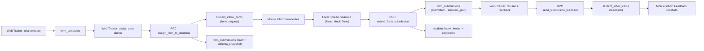

# Architecture Plan - Kinevo Forms & Inbox

## 1) Objetivo e Escopo

Criar um módulo unificado de **Avaliações e Comunicação** com foco inicial em:

- Treinador cria templates de formulários (anamnese, check-in, pesquisa).
- Treinador envia formulários para um ou vários alunos.
- Aluno responde pelo app (Inbox).
- Treinador visualiza respostas e envia feedback.
- Inbox preparada para evolução futura para mensagens de texto/chat.

Fora do escopo do MVP deste módulo:

- Chat síncrono em tempo real (ficará preparado pela arquitetura de `student_inbox_items`).
- Automações complexas (somente gatilho simples opcional no cadastro de aluno).

---

## 2) Princípios de Arquitetura

- **Híbrida relacional + JSONB**: metadados indexáveis em colunas; estrutura flexível em JSONB.
- **Versionamento de schema**: submissão guarda snapshot do schema usado no envio para preservar histórico.
- **Inbox como hub**: tudo que chega no aluno vira `student_inbox_items`.
- **RLS-first**: aluno só vê o que é dele, treinador só gerencia sua carteira.
- **Extensível para chat**: `type` + `payload` versionado por tipo.

---

## 3) Modelagem de Dados (PostgreSQL / Supabase)

## 3.1 `form_templates`

Responsável por armazenar modelos reutilizáveis criados pelo treinador.

```sql
CREATE TABLE form_templates (
    id UUID PRIMARY KEY DEFAULT gen_random_uuid(),
    trainer_id UUID NOT NULL REFERENCES trainers(id) ON DELETE CASCADE,
    title TEXT NOT NULL,
    description TEXT,
    category TEXT NOT NULL CHECK (category IN ('anamnese', 'checkin', 'survey')),
    schema_json JSONB NOT NULL,
    is_active BOOLEAN NOT NULL DEFAULT true,
    is_default_for_new_students BOOLEAN NOT NULL DEFAULT false,
    version INTEGER NOT NULL DEFAULT 1,
    created_at TIMESTAMPTZ NOT NULL DEFAULT now(),
    updated_at TIMESTAMPTZ NOT NULL DEFAULT now()
);

CREATE INDEX idx_form_templates_trainer_id ON form_templates(trainer_id);
CREATE INDEX idx_form_templates_category ON form_templates(trainer_id, category);
CREATE INDEX idx_form_templates_active ON form_templates(trainer_id) WHERE is_active = true;
CREATE INDEX idx_form_templates_schema_gin ON form_templates USING gin (schema_json);

-- Garante no máximo 1 anamnese padrão por treinador (opcional)
CREATE UNIQUE INDEX uq_form_templates_default_anamnese_per_trainer
    ON form_templates(trainer_id)
    WHERE is_default_for_new_students = true AND category = 'anamnese';
```

### Observações

- `schema_json`: JSON de definição de campos/perguntas.
- `version`: incrementado quando treinador edita o template (ou no publish).
- `is_default_for_new_students`: habilita automação de envio de anamnese.

## 3.2 `student_inbox_items`

Tabela central da aba Inbox no mobile.

```sql
CREATE TABLE student_inbox_items (
    id UUID PRIMARY KEY DEFAULT gen_random_uuid(),
    student_id UUID NOT NULL REFERENCES students(id) ON DELETE CASCADE,
    trainer_id UUID NOT NULL REFERENCES trainers(id) ON DELETE CASCADE,
    type TEXT NOT NULL CHECK (type IN ('form_request', 'feedback', 'system_alert', 'text_message')),
    status TEXT NOT NULL CHECK (status IN ('unread', 'pending_action', 'completed', 'archived')),
    title TEXT NOT NULL,
    subtitle TEXT,
    payload JSONB NOT NULL,
    due_at TIMESTAMPTZ,
    read_at TIMESTAMPTZ,
    completed_at TIMESTAMPTZ,
    archived_at TIMESTAMPTZ,
    created_at TIMESTAMPTZ NOT NULL DEFAULT now(),
    updated_at TIMESTAMPTZ NOT NULL DEFAULT now()
);

CREATE INDEX idx_inbox_student_status ON student_inbox_items(student_id, status, created_at DESC);
CREATE INDEX idx_inbox_student_type ON student_inbox_items(student_id, type, created_at DESC);
CREATE INDEX idx_inbox_trainer ON student_inbox_items(trainer_id, created_at DESC);
CREATE INDEX idx_inbox_payload_gin ON student_inbox_items USING gin (payload);
```

### Observações

- Inclui `text_message` já no enum para evolução futura sem migration de breaking.
- `title/subtitle` simplificam renderização rápida da lista.
- `payload` carrega referências e metadados por tipo.

## 3.3 `form_submissions`

Respostas do aluno e feedback do treinador.

```sql
CREATE TABLE form_submissions (
    id UUID PRIMARY KEY DEFAULT gen_random_uuid(),
    form_template_id UUID NOT NULL REFERENCES form_templates(id) ON DELETE RESTRICT,
    form_template_version INTEGER NOT NULL,
    trainer_id UUID NOT NULL REFERENCES trainers(id) ON DELETE CASCADE,
    student_id UUID NOT NULL REFERENCES students(id) ON DELETE CASCADE,
    inbox_item_id UUID NOT NULL UNIQUE REFERENCES student_inbox_items(id) ON DELETE CASCADE,
    status TEXT NOT NULL CHECK (status IN ('draft', 'submitted', 'reviewed')),
    schema_snapshot_json JSONB NOT NULL,
    answers_json JSONB,
    submitted_at TIMESTAMPTZ,
    trainer_feedback JSONB,
    feedback_sent_at TIMESTAMPTZ,
    created_at TIMESTAMPTZ NOT NULL DEFAULT now(),
    updated_at TIMESTAMPTZ NOT NULL DEFAULT now()
);

CREATE INDEX idx_form_submissions_student ON form_submissions(student_id, created_at DESC);
CREATE INDEX idx_form_submissions_trainer ON form_submissions(trainer_id, created_at DESC);
CREATE INDEX idx_form_submissions_template ON form_submissions(form_template_id, form_template_version);
CREATE INDEX idx_form_submissions_status ON form_submissions(status, submitted_at DESC);
CREATE INDEX idx_form_submissions_answers_gin ON form_submissions USING gin (answers_json);
```

### Observações

- `schema_snapshot_json` evita inconsistência se template for alterado depois do envio.
- `inbox_item_id` `UNIQUE` garante 1 submissão por solicitação de formulário.
- `trainer_feedback` em JSONB permite texto + metadados (tom, prioridade, tags).

## 3.4 Triggers utilitários

Aplicar trigger padrão `set_updated_at` nas 3 tabelas novas, seguindo padrão atual do projeto.

---

## 4) Contratos JSONB

## 4.1 `form_templates.schema_json`

```json
{
  "schema_version": "1.0",
  "layout": {
    "estimated_minutes": 8,
    "progress_mode": "per_question"
  },
  "questions": [
    {
      "id": "q_nome_completo",
      "type": "short_text",
      "label": "Nome completo",
      "required": true,
      "placeholder": "Digite seu nome",
      "validation": { "min_length": 3, "max_length": 120 }
    },
    {
      "id": "q_queixa_principal",
      "type": "long_text",
      "label": "Qual sua principal queixa hoje?",
      "required": true,
      "validation": { "max_length": 1000 }
    },
    {
      "id": "q_nivel_estresse",
      "type": "scale",
      "label": "Nível de estresse",
      "required": true,
      "scale": { "min": 1, "max": 5, "min_label": "Baixo", "max_label": "Alto" }
    },
    {
      "id": "q_qualidade_sono",
      "type": "single_choice",
      "label": "Como foi seu sono?",
      "required": true,
      "options": [
        { "value": "ruim", "label": "Ruim" },
        { "value": "regular", "label": "Regular" },
        { "value": "bom", "label": "Bom" }
      ]
    },
    {
      "id": "q_foto_postura",
      "type": "photo",
      "label": "Envie uma foto frontal",
      "required": false,
      "upload": {
        "bucket": "form-uploads",
        "max_files": 1,
        "max_size_mb": 8,
        "mime_types": ["image/jpeg", "image/png", "image/heic"]
      }
    }
  ]
}
```

### Tipos suportados no MVP

- `short_text`
- `long_text`
- `single_choice`
- `scale` (1-5 no MVP)
- `photo`

## 4.2 `form_submissions.answers_json`

```json
{
  "submitted_from": "mobile",
  "app_version": "1.0.0",
  "answers": {
    "q_nome_completo": { "type": "short_text", "value": "Ana Silva" },
    "q_queixa_principal": { "type": "long_text", "value": "Dor lombar ao agachar." },
    "q_nivel_estresse": { "type": "scale", "value": 4 },
    "q_qualidade_sono": { "type": "single_choice", "value": "regular" },
    "q_foto_postura": {
      "type": "photo",
      "files": [
        {
          "path": "students/{student_id}/submissions/{submission_id}/frontal.jpg",
          "url": "https://<project>.supabase.co/storage/v1/object/public/form-uploads/...",
          "width": 1080,
          "height": 1440
        }
      ]
    }
  }
}
```

## 4.3 `student_inbox_items.payload` por tipo

### `form_request`

```json
{
  "payload_version": 1,
  "form_template_id": "uuid",
  "form_template_version": 3,
  "submission_id": "uuid",
  "category": "anamnese",
  "request_message": "Por favor preencha antes do próximo treino."
}
```

### `feedback`

```json
{
  "payload_version": 1,
  "submission_id": "uuid",
  "origin_inbox_item_id": "uuid",
  "feedback_preview": "Ótimo progresso no controle de dor."
}
```

### `system_alert`

```json
{
  "payload_version": 1,
  "kind": "reminder",
  "target_type": "form_request",
  "target_id": "uuid"
}
```

---

## 5) RLS e Segurança

## 5.1 Políticas recomendadas

- `form_templates`
  - `SELECT/INSERT/UPDATE/DELETE`: somente `trainer_id = current_trainer_id()`.
- `student_inbox_items`
  - Treinador: `FOR ALL` quando `trainer_id = current_trainer_id()`.
  - Aluno: `SELECT/UPDATE(read_at,status,completed_at,archived_at)` quando `student_id = current_student_id()`.
- `form_submissions`
  - Treinador: `SELECT/UPDATE` em submissões dos seus alunos.
  - Aluno: `SELECT/INSERT/UPDATE` somente quando `student_id = current_student_id()`.

## 5.2 RPCs (SECURITY DEFINER) recomendadas

- `assign_form_to_students(p_form_template_id uuid, p_student_ids uuid[], p_due_at timestamptz, p_message text)`
  - Cria `student_inbox_items` (`form_request`) + `form_submissions` em `draft`.
- `submit_form_submission(p_submission_id uuid, p_answers_json jsonb)`
  - Valida ownership do aluno, marca `submitted`, seta `submitted_at`, atualiza item inbox para `completed`.
- `send_submission_feedback(p_submission_id uuid, p_feedback jsonb, p_mark_read boolean default false)`
  - Salva feedback e cria inbox item de `feedback`.

Essas RPCs reduzem lógica sensível no client e evitam regras complexas de multi-write sob RLS.

---

## 6) Fluxo Web (Treinador)

## 6.1 Editor de Formulários

Tela: `Web > Forms`.

Componentes:

- Lista de templates (filtro por categoria + status).
- Botão `Novo Formulário`.
- Builder com:
  - Cabeçalho: `title`, `category`, `description`.
  - Painel de blocos (tipos de pergunta).
  - Canvas central com reorder (drag and drop).
  - Propriedades da pergunta (label, obrigatório, opções, validações).
  - Preview em tempo real.
  - Ações: `Salvar rascunho`, `Publicar`, `Duplicar`.

Validações de publicação:

- `title` obrigatório.
- Pelo menos 1 pergunta.
- Cada pergunta com `id` único.
- `single_choice` precisa de >= 2 opções.
- `scale` no intervalo 1-5 para MVP.

## 6.2 Salvar como Template reutilizável

- Todo formulário publicado entra em `form_templates`.
- Edição de template já utilizado:
  - Incrementa `version`.
  - Não altera `schema_snapshot_json` das submissões existentes.

---

## 7) Fluxo de Assignment (Envio)

## 7.1 UX de envio no Web

Entrada por:

- Página de detalhe do template (`Enviar`).
- Página de detalhe do aluno (`Solicitar Formulário`).

Fluxo:

1. Treinador escolhe template.
2. Seleciona 1..N alunos (multi-select com busca).
3. Define opcional: `due_at`, mensagem de contexto.
4. Dispara RPC `assign_form_to_students`.
5. Sistema cria:
   - `student_inbox_items` com `type='form_request'`, `status='pending_action'`.
   - `form_submissions` em `draft`.

## 7.2 Idempotência e anti-duplicação

- Regra recomendada: evitar múltiplos requests pendentes do mesmo template para o mesmo aluno.
- Implementação: índice parcial (opcional) ou validação na RPC.

Exemplo de regra:

- Bloquear novo envio se existir `student_inbox_items` do tipo `form_request` em `pending_action/unread` para o mesmo `submission context`.

---

## 8) Automação Bônus: Anamnese padrão no cadastro de aluno

## 8.1 Estratégia

Quando um novo registro entra em `students`, disparar trigger que verifica se treinador tem template:

- `category = 'anamnese'`
- `is_default_for_new_students = true`
- `is_active = true`

Se existir, cria inbox + submission automaticamente.

## 8.2 Trigger proposta

```sql
CREATE OR REPLACE FUNCTION auto_assign_default_anamnese_on_student_create()
RETURNS TRIGGER
LANGUAGE plpgsql
SECURITY DEFINER
SET search_path = public
AS $$
DECLARE
    v_template form_templates%ROWTYPE;
    v_inbox_id UUID;
BEGIN
    SELECT *
      INTO v_template
      FROM form_templates
     WHERE trainer_id = NEW.trainer_id
       AND category = 'anamnese'
       AND is_default_for_new_students = true
       AND is_active = true
     LIMIT 1;

    IF v_template.id IS NULL THEN
        RETURN NEW;
    END IF;

    INSERT INTO student_inbox_items (
        student_id, trainer_id, type, status, title, subtitle, payload
    ) VALUES (
        NEW.id,
        NEW.trainer_id,
        'form_request',
        'pending_action',
        'Anamnese Inicial',
        'Preencha para iniciar seu acompanhamento',
        jsonb_build_object(
            'payload_version', 1,
            'form_template_id', v_template.id,
            'form_template_version', v_template.version,
            'category', v_template.category
        )
    ) RETURNING id INTO v_inbox_id;

    INSERT INTO form_submissions (
        form_template_id,
        form_template_version,
        trainer_id,
        student_id,
        inbox_item_id,
        status,
        schema_snapshot_json
    ) VALUES (
        v_template.id,
        v_template.version,
        NEW.trainer_id,
        NEW.id,
        v_inbox_id,
        'draft',
        v_template.schema_json
    );

    RETURN NEW;
END;
$$;
```

Aplicação:

```sql
CREATE TRIGGER trg_auto_assign_anamnese
AFTER INSERT ON students
FOR EACH ROW
EXECUTE FUNCTION auto_assign_default_anamnese_on_student_create();
```

---

## 9) Experiência Mobile (Aba Inbox)

## 9.1 Navegação

Adicionar nova tab `inbox` no mobile (`mobile/app/(tabs)/inbox.tsx`) e atualizar layout de tabs.

Seções da tela:

- `Pendentes`: `status IN ('unread','pending_action')`.
- `Concluídos`: `status='completed'`.
- `Arquivados`: `status='archived'` (opcional no MVP, pode ficar oculto inicialmente).

## 9.2 Abrir item de formulário

Ao tocar no item `form_request`:

1. Buscar `form_submissions` (por `inbox_item_id`).
2. Ler `schema_snapshot_json`.
3. Renderizar formulário dinâmico com React Hook Form:
   - Mapeamento `type -> componente`.
   - Validação derivada de `validation` no schema.
4. Upload de `photo` via Supabase Storage.
5. Enviar via RPC `submit_form_submission`.

## 9.3 Pós-envio

- `student_inbox_items.status` muda de `pending_action` para `completed`.
- Item migra automaticamente da lista `Pendentes` para `Concluídos`.
- Pode aparecer toast local: `Resposta enviada`.

## 9.4 Feedback do treinador

- Feedback chega como novo `student_inbox_items` com `type='feedback'`.
- Ao abrir, mostra conteúdo e referência da submissão original.

---

## 10) Push Notification (gancho planejado)

Resposta para MVP: **Sim, com gancho técnico preparado desde a primeira versão**.

## 10.1 Estrutura mínima

- Tabela já existente/futura para tokens push (por device).
- Edge Function ou backend worker para disparo.
- Evento de envio:
  - Novo `student_inbox_items` com tipo `form_request` ou `feedback`.

## 10.2 Estratégia inicial

- Na V1, criar apenas o trigger de evento (ou fila) sem bloquear entrega do módulo.
- Se push falhar, Inbox continua sendo fonte de verdade.

---

## 11) Fluxo de Dados Fim a Fim



---

## 12) Plano de Implementação por Fases

## Fase 1 - Banco + Contratos (base)

- Criar migration com 3 tabelas + índices + triggers `updated_at`.
- Criar políticas RLS.
- Criar RPCs: assign, submit, feedback.
- Atualizar tipos compartilhados (`shared/types/database.ts`).

## Fase 2 - Web Forms (Treinador)

- Página de listagem e editor de templates.
- Persistência de `schema_json`.
- Fluxo de assignment para 1..N alunos.
- Tela de leitura de submissões + envio de feedback.

## Fase 3 - Mobile Inbox (Aluno)

- Nova tab Inbox.
- Listagem por status.
- Tela dinâmica do formulário com React Hook Form.
- Upload de foto e envio de submissão.
- Tela de leitura de feedback.

## Fase 4 - Automação + Notificações

- Trigger de anamnese padrão no `students`.
- Gancho de push para novos inbox items.
- Observabilidade (logs de RPC, contadores de entrega/resposta).

---

## 13) Critérios de Aceite (MVP)

- Treinador consegue criar template com os 5 tipos de campo definidos.
- Treinador consegue enviar template para múltiplos alunos.
- Aluno recebe item no Inbox e responde no app.
- Resposta fica disponível no Web para o treinador.
- Treinador envia feedback e aluno visualiza no Inbox.
- Envio manual e automático (anamnese padrão) funcionando conforme configuração.

---

## 14) Riscos e Mitigações

- **Mudança de template após envio**: mitigado com `schema_snapshot_json`.
- **Duplicidade de assignments**: mitigado via regra de idempotência na RPC.
- **Payload inconsistente**: mitigado com `payload_version` e validação server-side.
- **Uploads grandes em mobile**: limites por tipo/pergunta + compressão antes do upload.

---

## 15) Próximos passos técnicos imediatos

1. Criar migration `025_forms_inbox_schema.sql` com DDL + RLS + RPCs.
2. Atualizar tipos compartilhados após aplicar migration.
3. Implementar `Web > Forms` (CRUD template + assignment).
4. Implementar tab `Inbox` no mobile e formulário dinâmico.
5. Fechar trigger opcional de anamnese automática.

